# AeroVerify: High-Performance Neuro-Symbolic Runway Visibility Forecaster

AeroVerify is a research-grade, spatial-temporal predictive engine and formal verification framework designed to forecast terminal Runway Visual Range (RVR) visibility degradation (fog collapse) at Delhi Indira Gandhi International (IGI) Airport across a multi-step future horizon ($t+1$ to $t+6$ hours).

The platform bridges the gap between connectionist neural learning and symbolic reasoning (Neuro-Symbolic AI). It couples a **Deep PyTorch GRU Sequence Network** and **Multi-Horizon Tree Ensemble Regressors** with a **Z3 SMT (Satisfiability Modulo Theories) Solver** to enforce physical meteorological axioms in real-time, preventing physically impossible predictions during severe weather scenarios.

---

## 🏗️ System Architecture

GitHub natively renders the flowchart below detailing the end-to-end data pipeline, multi-model sequences, and Z3 formal verification guardrails:

```mermaid
graph TD
    %% Define Node Styles via Classes
    classDef default fill:#1e293b,stroke:#334155,stroke-width:1px,color:#f1f5f9,rx:8px,ry:8px;
    classDef ingest fill:#0f172a,stroke:#0ea5e9,stroke-width:2px,color:#f1f5f9,rx:8px,ry:8px;
    classDef feature fill:#0f172a,stroke:#6366f1,stroke-width:2px,color:#f1f5f9,rx:8px,ry:8px;
    classDef model fill:#0f172a,stroke:#a855f7,stroke-width:2px,color:#f1f5f9,rx:8px,ry:8px;
    classDef guardrail fill:#0f172a,stroke:#f43f5e,stroke-width:2px,color:#f1f5f9,rx:8px,ry:8px;
    classDef dashboard fill:#0f172a,stroke:#10b981,stroke-width:2px,color:#f1f5f9,rx:8px,ry:8px;
    classDef dataset fill:#1e293b,stroke:#94a3b8,stroke-width:1px,stroke-dasharray: 5 5,color:#cbd5e1,rx:5px,ry:5px;

    %% Subgraphs
    subgraph Ingestion ["🌐 Phase 1: Spatial Data Fusion"]
        A["NOAA Delhi Airport (Station 421810)"]:::ingest
        B["NOAA Urban Core (Station 421820)"]:::ingest
        C["NOAA Rural Baseline (Station 421390)"]:::ingest
        D["NASA AERONET Column AOD"]:::ingest
        E[("delhi_2024_master_fused.csv")]:::dataset
        
        A --> E
        B --> E
        C --> E
        D --> E
    end

    subgraph FeatureEngineering ["🧪 Phase 2: Domain Feature Engineering"]
        F["Domain Knowledge Suite"]:::feature
        G["Thermodynamic Features (Magnus-Tetens RH, DPD)"]:::feature
        H["Kinematic Features (Stagnancy, U/V Wind)"]:::feature
        I["Spatial-Optical Features (Aerosol Proxy, Gradients)"]:::feature
        J[("delhi_2024_engineered.csv")]:::dataset

        E --> F
        F --> G
        F --> H
        F --> I
        G --> J
        H --> J
        I --> J
    end

    subgraph Modeling ["🤖 Phase 3: Multi-Model Sequencing"]
        K["24-Hour Sliding Window Sequencing"]:::model
        L["Multi-Horizon Random Forest"]:::model
        M["Multi-Horizon XGBoost"]:::model
        N["Deep PyTorch GRU Recurrent Net"]:::model

        J --> K
        K --> L
        K --> M
        K --> N
    end

    subgraph Guardrail ["🛡️ Phase 4: Z3 SMT Symbolic Guardrails"]
        O["Z3 SMT Verification Interceptor"]:::guardrail
        P["METAR Real-time Parameter Overrides"]:::guardrail
        Q["Physical Axioms (Dry Air, Stagnation, Aerosol Attenuation)"]:::guardrail
        R["SAT: Approved Prediction"]:::guardrail
        S["UNSAT: SMT Optimization Override & Clamp"]:::guardrail

        L --> O
        M --> O
        N --> O
        P --> O
        O --> Q
        Q -->|SAT| R
        Q -->|UNSAT| S
    end

    subgraph Interface ["📊 Phase 6: Glassmorphic UI Dashboard"]
        T["Interactive Simulator Console API"]:::dashboard
        
        R --> T
        S --> T
    end

    %% Subgraph Styling
    style Ingestion fill:#0b0f19,stroke:#0ea5e9,stroke-width:1px,stroke-dasharray: 3 3
    style FeatureEngineering fill:#0b0f19,stroke:#6366f1,stroke-width:1px,stroke-dasharray: 3 3
    style Modeling fill:#0b0f19,stroke:#a855f7,stroke-width:1px,stroke-dasharray: 3 3
    style Guardrail fill:#0b0f19,stroke:#f43f5e,stroke-width:1px,stroke-dasharray: 3 3
    style Interface fill:#0b0f19,stroke:#10b981,stroke-width:1px,stroke-dasharray: 3 3
```



---

## 🔬 Core Project Phases

The engine is engineered in 6 distinct sequential research phases:

### Phase 1: Spatial Data Fusion Lake
Integrates three geographical meteorological hubs to capture regional microclimates, transport corridors, and background baselines:
* **Delhi IGI Airport (Station 421810)**: Terminal target station prone to heavy radiation fog.
* **Safdarjung Observatory (Station 421820)**: Dense urban central core baseline capturing municipal urban heat island (UHI) signatures.
* **Rohtak Regional Baseline (Station 421390)**: Upwind rural background tracking macro-scale transboundary agricultural biomass plumes.
* **NASA AERONET Column Hub**: Ground-based sun photometer tracking real-time Aerosol Optical Depth (AOD) characteristics.
* Chronological rows are resampled to uniform 1-hour intervals, utilizing time-series persistence methods to yield **0.00% missing values** across all dimensions without future target leakage.

### Phase 2: Domain-Knowledge Feature Engineering
Derives 25 specialized thermodynamic and optical features to capture fog kinetic precursors:
* **Dew Point Depression (DPD)**: $DPD = T - T_{dew}$ (closeness to saturation).
* **Relative Humidity (RH)**: Derived using the Magnus-Tetens formula.
* **Wind Stagnation Index (WSI)**: Flags stagnant conditions (wind speed $< 1.5\text{ m/s}$) that trap moisture.
* **Wind Vectoring ($U$ & $V$)**: Maps wind bearing and speed to transport coordinate axes: $u = s \times \sin(\theta), v = s \times \cos(\theta)$.
* **Aerosol Scattering Extinction Proxy (ASEP)**: $AOD_{500nm} / AOD_{440nm}$ representing Angstrom size distributions.
* **Spatial Thermal Gradients**: Calculates temperature differentials between urban, rural, and runway environments.

### Phase 3: Neural & Tabular Multi-Model Benchmarks
Models Delhi’s winter fog sequence using a 24-hour historical window to predict the $t+1$ to $t+6$ hour horizons:
1. **Multi-Horizon Random Forest Regressor**: Outperforms sequential models on short horizons ($t+1$ to $t+3$) with a stellar MAE of **441.71 meters** at $t+1$.
2. **Multi-Horizon XGBoost Regressor**: Explores tree-gradient boosted residual trends.
3. **Deep PyTorch GRU Recurrent Sequence Network**: Captures long-horizon kinetics, achieving the best $t+6$ performance at **953.47 meters** using standardizer target scaling to resolve training convergence issues.

### Phase 4: Z3 Formal Verification ("The Symbolic Guardrail")
Interceptors raw connectionist forecasts and audits them against physical atmospheric boundaries using **Microsoft Research's Z3 SMT Solver**:
* **Axiom 1 (Dry Air Impossibility)**: If $RH < 45\%$ or $DPD > 12^\circ\text{C}$, runway visibility must be at least **$800$ meters**. Fog cannot physically exist in dry air.
* **Axiom 2 (Saturated Stagnation)**: If $RH \ge 98\%$ and the wind is stagnant ($WSI == 1.0$), runway visibility is capped at **$2500$ meters**. Fog is physically certain.
* **Axiom 3 (Aerosol Attenuation)**: If regional $AOD_{500nm} > 1.8$, runway visibility is capped at **$3500$ meters** due to extreme physical particulate scattering.
* Enforcing these axioms **lowers the overall Mean Absolute Error (MAE) by 1.64 meters** at $t+6$, proving that constraining machine learning models with physics-safe boundaries improves generalization.

### Phase 5: Safety-Critical Evaluation Framework
Audits historical winter fog collapse events ($<800$m instrument flight shutoffs, and $<500$m Category II/III severe operations halts) using Brier probabilistic calibration and F1 metrics. Random Forest (and its Z3-verified version) remains the only model resilient against conservative regression bias, flagging safety collapses with **84.71% accuracy** at $t+6$.

### Phase 6: Web Dashboard Beautification & Interactive Analytics
A publication-grade front-end interface built on top of Flask:
* **Glassmorphic UI**: Translucent glass panels, ambient drifting glow backdrops, and harmonious dark-mode styling.
* **Simulation Sandbox**: Interlinked number inputs and range sliders with event synchronizations to perform dynamic METAR overrides.
* **Telemetry Progress Meters**: Glowing indicators displaying derived Relative Humidity, Dew Point Depression warning gradients, and Wind Stagnation pulsing lamps.
* **Live Corrective Audit Log**: Compares raw vs. verified predictions side-by-side and displays explicit Z3 clamping warnings during UNSAT triggers.

---

## 💻 Directory Structure

```text
climate-visibility-new/
├── .github/workflows/       # GitHub Actions CI pipeline configuration
├── data/
│   ├── raw/                 # Unaltered source ISD files & NASA AOD logs
│   └── processed/           # Engineered datasets, metrics, and figures
├── logs/                    # Local runtime logs and execution trace history
├── models/                  # Serialized scalers, GRU weights, and RF/XGB models
├── notebooks/               # Interactive Jupyter engineering workbooks
│   ├── 01_data_fusion_lake.ipynb
│   ├── 02_eda_feature_engineering.ipynb
│   ├── 03_visibility_modeling.ipynb
│   ├── 04_safety_verification.ipynb
│   └── 05_safety_evaluation.ipynb
├── scripts/                 # Ingestion drivers and Z3 formal solver class
│   ├── data_fusion_pipeline.py
│   └── z3_verification.py
├── src/                     # Core application packages
│   ├── app/                 # Flask server, static assets, HTML templates
│   ├── components/          # Ingestion, validation, training, and evaluation scripts
│   ├── pipeline/            # Training pipeline and real-time inference drivers
│   ├── config.py            # Global constant schemas and file paths
│   └── utils.py             # Centralized logger setup and S3 handlers
├── Dockerfile               # Highly optimized CPU-only container builder
├── .dockerignore            # Excludes massive files to maintain light image footprints
├── pyproject.toml           # Poetry stack configuration
├── poetry.lock              # Complete cryptographic package dependency lockfile
└── readme.md                # System documentation
```

---

## ⚡ Environment Onboarding & Native Execution (Poetry)

This project leverages **Poetry** for deterministic package management. Follow these steps to provision your local environment natively:

### 1. Configure Poetry and Install Stack Dependencies
```bash
# Force Poetry to place the binary environment locally inside the project directory
poetry config virtualenvs.in-project true

# Install all core packages (pandas, PyTorch, XGBoost, Z3-Solver) inside the local sandbox
poetry install
```

### 2. Configure Environment Credentials (`.env` File)
Create a file named `.env` at the root of the project directory to configure your AWS S3 model registry and MongoDB telemetry databases:
```env
# MongoDB Connection String (for real-time telemetry logging)
MONGO_DB_URI="your_mongodb_connection_uri"

# AWS S3 Configurations (for automated model backups and dynamic cloud syncs)
AWS_ACCESS_KEY_ID="your_aws_access_key_id"
AWS_SECRET_ACCESS_KEY="your_aws_secret_access_key"
AWS_S3_BUCKET="your_aws_s3_bucket_name"
```
> [!NOTE]
> If these variables are not configured or the `.env` file is missing, the engine will automatically fall back to **Local Storage Mode**, loading pre-trained model checkpoints and running predictions natively from your local disk folder.

### 3. Spawn Virtual Environment Shell
```bash
poetry shell
```

### 4. Run the End-to-End Orchestrator Pipeline
You can trigger the entire data ingestion, spatial validation, domain feature engineering, multi-model training, early-stopping model serialization, and Z3 baseline evaluations with a single command:
```bash
python src/pipeline/training_pipeline.py
```
This logs detailed debug details in real-time to the console and writes complete trace records to `logs/pipeline_execution.log`.

---

## 🐳 Docker Onboarding & Execution (CPU-Optimized)

The [Dockerfile](file:///Users/vedikaagrawal/Documents/climate-visibility-new/Dockerfile) is heavily optimized for Apple Silicon (M1) and storage-constrained MacBooks. It directly installs a **CPU-only PyTorch build** and drops the final image layer size from over 3.5 GB to **952 MB**.

### 1. Build the Docker Image
```bash
docker build -t aero-verify:latest .
```

### 2. Run the Container Locally (With Volume Mounts)
To keep the image lightweight, large model weights and data files are mounted dynamically as volumes. Start the container by running:
```bash
docker run -p 5050:5050 \
  -v "$(pwd)/models:/app/models" \
  -v "$(pwd)/data:/app/data" \
  -v "$(pwd)/logs:/app/logs" \
  aero-verify:latest
```
Access the interactive web dashboard in your browser at: **[http://127.0.0.1:5050](http://127.0.0.1:5050)**

### 3. Deploying to Render
To deploy your container live in the cloud:
1. Push your code to your linked GitHub repository.
2. In **Render**, create a new **Web Service** and select your repository.
3. Set the Runtime to **Docker** and Instance Type to the **Free** tier.
4. Under **Environment Variables**, add the 4 S3 and MongoDB keys from your local `.env` file. Render will automatically boot the image, download the models dynamically from AWS S3, and host your service online!

---

## 📊 Scientific Diagnostics Performance

### Model Diagnostics Summary Table

| Horizon | RF MAE (m) | RF RMSE (m) | XGB MAE (m) | XGB RMSE (m) | GRU MAE (m) | GRU RMSE (m) |
| :---: | :---: | :---: | :---: | :---: | :---: | :---: |
| **$t+1$ hour** | **441.71** | 556.99 | 513.01 | 636.20 | 1125.47 | 1330.04 |
| **$t+2$ hours** | **500.08** | 625.99 | 639.96 | 800.10 | 1135.59 | 1332.85 |
| **$t+3$ hours** | **533.47** | 684.74 | 710.09 | 878.63 | 1114.52 | 1306.77 |
| **$t+4$ hours** | **722.06** | 916.50 | 820.69 | 1020.34 | 1085.33 | 1275.01 |
| **$t+5$ hours** | **745.54** | 933.53 | 894.25 | 1104.43 | 1007.03 | 1195.70 |
| **$t+6$ hours** | **733.99** | 937.86 | 939.36 | 1162.98 | **953.47** | 1130.61 |

### Z3 Safety Auditor Intervention Diagnostics

| Horizon | Raw MAE (m) | Verified MAE (m) | MAE Improvement (m) | Audited Violations (Count) | Physical Violation Rate (%) |
| :---: | :---: | :---: | :---: | :---: | :---: |
| **$t+1$ hour** | **441.7144** | **441.7144** | **0.0000** (Perfect SAT) | 0 | 0.00% |
| **$t+2$ hours** | **500.0806** | **500.0806** | **0.0000** (Perfect SAT) | 0 | 0.00% |
| **$t+3$ hours** | **533.4744** | **533.4744** | **0.0000** (Perfect SAT) | 0 | 0.00% |
| **$t+4$ hours** | **722.0591** | **721.4395** | **0.6196** | 6 | 0.46% |
| **$t+5$ hours** | **745.5403** | **744.1205** | **1.4198** | 12 | 0.93% |
| **$t+6$ hours** | **733.9980** | **732.3533** | **1.6447** | **17** | **1.31%** |